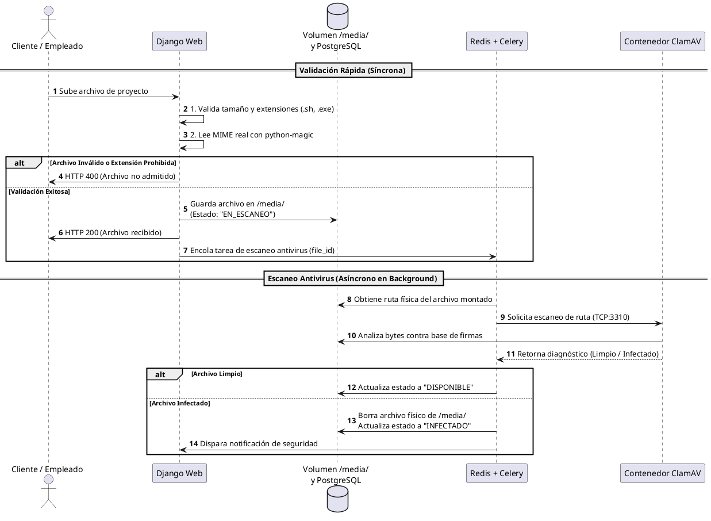

# Pipeline de Validación y Antivirus de Documentos — Plataforma Sinergi

> **Documento:** Especificación Técnica de Seguridad Documental  
> **Proyecto:** Plataforma Web Integral Sinergi  
> **Componente:** Validación de Archivos, Tareas Asíncronas y Antivirus  
> **Estado:** Línea base técnica cerrada  

## 1. Alcance y Contexto

Los usuarios de la plataforma (clientes y personal de Sinergi) intercambian archivos técnicos para la ejecución de proyectos: planos CAD/DWG, documentos Word, hojas de cálculo Excel, presentaciones, imágenes y archivos PDF.

Para prevenir la ejecución o almacenamiento de scripts maliciosos, suplantación de extensiones y distribución de malware sin degradar el tiempo de respuesta del servidor web, se implementa una arquitectura en capas dividida en dos fases: validación preliminar síncrona en Django y escaneo antivirus asíncrono con ClamAV mediante Celery.

## 2. Proceso de Validación en 4 Capas

```text
[Archivo Subido por el Usuario]
               │
               ▼
   [Capa 1: Tamaño Máximo] ──────(Supera límite)─────▶ [HTTP 400: Rechazo Inmediato]
               │ (Válido)
               ▼
   [Capa 2: Lista Negra] ────────(Extensión .exe/.sh)─▶ [HTTP 400: Rechazo Inmediato]
               │ (Válido)
               ▼
   [Capa 3: MIME Real (Magic)] ──(Cabecera falsa)────▶ [HTTP 400: Rechazo Inmediato]
               │ (Válido)
               ▼
   [Persistencia en /media/ con estado "EN_ESCANEO"]
               │
               ▼ (Django Signal encola tarea en Celery)
   [Capa 4: Escaneo ClamAV] ─────(Malware detectado)──▶ [Borrado de disco + Alerta]
               │ (Limpio)
               ▼
   [Estado: "DISPONIBLE" para Descarga]
```

### Capa 1: Límite de Tamaño de Archivo

- **Ejecución:** Síncrona a nivel de proxy inverso y validadores en formularios de Django.
- **Objetivo:** Evitar agotamiento de memoria y denegación de servicio (DoS) por subida de ficheros desproporcionados.

### Capa 2: Lista Negra de Extensiones

- **Ejecución:** Síncrona en backend.
- **Regla:** Bloqueo terminante de extensiones ejecutables o interpretadas por scripts, con independencia del nombre provisto.
- **Extensiones no permitidas:** `.sh`, `.exe`, `.bat`, `.cmd`, `.msi`, `.php`, `.phtml`, `.py`, `.js`, `.vbs`, `.bin`, `.jar`.

### Capa 3: Inspección de MIME Real (`python-magic`)

- **Ejecución:** Síncrona en memoria antes de confirmar la persistencia definitiva.
- **Regla:** La librería `python-magic` lee los números mágicos (*magic bytes*) de la cabecera binaria del archivo para verificar su naturaleza real, impidiendo que un script renombrado (ejemplo: `script.sh` a `plano.pdf`) sea aceptado.
- **Formatos autorizados:**
  - Documentación: PDF (`application/pdf`), Word (`.docx`, `.doc`), Excel (`.xlsx`, `.xls`), PowerPoint (`.pptx`, `.ppt`).
  - Diseños e imágenes: Formatos CAD/DWG, PNG, JPEG, WEBP.

### Capa 4: Escaneo Antivirus Asíncrono (ClamAV)

- **Ejecución:** Asíncrona fuera del hilo de atención HTTP.
- **Regla:** El archivo se guarda en el volumen compartido `/media/` con la marca inicial de base de datos `EN_ESCANEO`.
- Un `django signal` dispara una tarea a Celery a través de Redis.
- El contenedor `celery-worker` solicita al demonio `clamd` en el contenedor `clamav` la revisión de los bytes del fichero.
- **Resultado Limpio:** La base de datos actualiza el estado a `DISPONIBLE` y permite la descarga o visualización del documento.
- **Resultado Infectado:** El worker borra físicamente el archivo del volumen `/media/`, marca el registro como `INFECTADO` y notifica al usuario o administrador sobre el incidente.

## 3. Componentes de Infraestructura

- **Contenedor** **`web`** **(Django):** Ejecuta la validación de las capas 1 a 3 y emite las señales de base de datos.
- **Contenedor** **`redis`**:** Actúa de intermediario de mensajes (*message broker*) para las tareas de validación en segundo plano.
- **Contenedor** **`celery-worker`**:** Procesa la tarea asíncrona y se comunica mediante protocolo TCP con el antivirus.
- **Contenedor** **`clamav`**:** Contenedor con el motor ClamAV y el demonio `clamd` escuchando en el puerto interno 3310.
- **Volumen** **`/media/`**:** Directorio persistente montado en común entre `web`, `celery-worker` y `clamav` para permitir acceso al disco sin transferencias pesadas por red.

## 4. Diagrama de Flujo (PlantUML)

Fragmento de código



## 5. Criterios de Aceptación (QA)

- **CA-01 (Filtro síncrono de extensiones):** Subir un archivo `.exe` o `.sh` resulta en un rechazo HTTP 400 sin crear registros en la base de datos ni escribir en `/media/`.
- **CA-02 (Filtro por encabezados reales):** Renombrar un script binario o bash como archivo `.pdf` es detectado por `python-magic`, devolviendo error de formato.
- **CA-03 (No bloqueo de interfaz):** La carga de documentos pesados válidos responde al cliente en menos de 2 segundos, procesando el escaneo en segundo plano.
- **CA-04 (Eliminación de archivos infectados):** La carga del archivo de prueba estándar `eicar.com.txt` activa la detección de ClamAV, eliminando el archivo del volumen e inhabilitando su descarga.
- **CA-05 (Control de disponibilidad):** Ningún archivo con estado distinto de `DISPONIBLE` puede ser descargado por endpoints de clientes o empleados.
